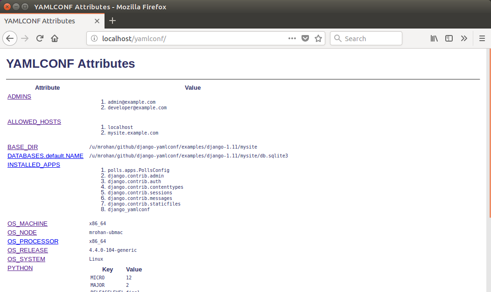

# django-yamlconf

`django_yamlconf` is part of VMware's support of open source development
and community.

Handle YAML based Django settings: load Django settings from YAML files
based on a Django project name.  The YAML files loaded start with a YAML
file in the directory containing the Django settings file and then loads
any other YAMLCONF files up the directory tree from the initial file.  Values
from files higher up the directory tree over-ride lower in the tree.  The
contents of the YAML file simply defines values that over-ride (or add to)
attributes of the standard Django settings file, e.g., for the project
"buildaudit", the settings.py file could contain:

```python
    DEBUG = True
```

i.e., the value for development.  This can be redefined via a `buildaudit.yaml`
file using the definition:

```python
    DEBUG: false
```

If the environment variable `YAMLCONF_CONFFILE` is defined, it uses as the
final YAML file loaded (in this case, the file name does not need to match
the project name and it can be located anywhere in the file system).

## License

`django-yamlconf` is release under the BSD-2 license, see the LICENSE file.

SPDX-License-Identifier: BSD-2-Clause

## Usage

The YAMLCONF definitions are added to the Django settings file by
including a call to the `load` function in the settings file.  This would
normally be towards the end of the settings file.  The simplest, and
likely normal usage is to call without arguments.  YAMLCONF will infer
the project information from the call stack.  For a standard Django
application structure, the settings file:

```
    myproject/myproject/settings.py
```

would contain the development oriented definitions, e.g., database
definitions for user and password for a development database.  The
settings file would then end with a call the the `load` function.
Additional definitions could be defined after the `load` function
to update conditional definitions, e.g., if `DEBUG` is enabled.

```python
import django_yamlconf

DATABASES = {
    'default': {
        'NAME': 'example',
        'USER': 'example',
        'PASSWORD': 'example',
        'HOST': 'localhost',
        ...
    }
}
...

django_yamlconf.load()
```

On a production server, for this example, a `myproject.yaml` would be put in
place containing the host name for the production database and the password
for the example user (assuming production is using the same database name
and username).  In this example, a random `pwgen` password is used:

```yaml
DATABASES.default.PASSWORD: 'zibiemohjuD6foh0'
DATABASES.default.HOST: 'myproject-db.eng.vmware.com'
```

See the `load` function for more information on other optional
arguments.

## Management Commands

YAMLCONF includes three management commands (`django_yamlconf` needs to be
added to the `INSTALLED_APPS` to add these commands):

* `ycexplain`: explain where an attribute value was defined

* `yclist`: list the attribute values defined via YAMLCONF

* `ycsysfiles`: Create system control files based on attribute controlled
  template files

The attributes available to the management commands can be extended using
methods returning dictionaries of values.  The method names can be defined
in the `settings` file or via a YAMLCONF file via the attribute
`YAMLCONF_ATTRIBUTE_FUNCTIONS`, e.g.,

```yaml
YAMLCONF_ATTRIBUTE_FUNCTIONS:
  - 'health_checks.ycattrs.attributes'
```

As can be seen from the example method above, these additional attibutes
are primarily used with the `ycsysfiles` command.

### `ycexplain` Command

This `ycexplain` gives information on the value defined by the set of YAML
files loaded for an application along with any documentation and information
on eclipsed attribute values lower in the directory tree structure.  For
example, for the `DEBUG` attribute:

```
    $ python manage.py ycexplain DEBUG
    ---------------------------
    DEBUG = "False" (via "/u/mrohan/clients/xmpl/buildaudit.yaml")

    Documentation:
        Enable or disable debugging functionality.  On the production
        server this attribute should be set to false

    Eclipsed values:
        "True" via "/u/mrohan/clients/xmpl/buildaudit/buildaudit.yaml"
        "True" via "buildaudit.settings"
```

### `yclist` Command

The `yclist` command simply lists the attributes defined via YAML files,
e.g.,:

```shell
    $ python manage.py yclist
    Listing YAMLCONF managed attributes

    ALLOWED_HOSTS                   ['localhost']
    BACKUP_CONFIG.directory         {BASE_DIR}/backup
    BASE_DIR                        /home/mrohan/clients/osstp-yc/webapps
    CONTROL_FILE                    {WEBAPPS_DIR}/osstpmgt.yaml
    DATABASES.default.CONN_MAX_AGE  600
    DATABASES.default.HOST          {DBHOST}
    DATABASES.default.NAME          {DBNAME}
    DATABASES.default.PASSWORD      {DBPASSWORD}
    DATABASES.default.USER          {DBUSER}
    DBHOST                          localhost
    DBNAME                          osstp
    DBPASSWORD                      A-Password
    DBUSER                          osstp
    INSTALL_DIR                     /var/oss/osstp
    MANAGE_PY                       {WEBAPPS_DIR}/manage.py
    OS_MACHINE                      x86_64
    OS_NODE                         mrohan-osstp-yc
    OS_PROCESSOR                    x86_64
    OS_RELEASE                      4.4.0-101-generic
    OS_SYSTEM                       Linux
    ROOT_URL                        https://{SERVER_NAME}
    SCM_ID                          v2017.07.13-103-gfac514b
    SERVER_NAME                     localhost
    TOP_DIR                         /home/mrohan/clients/osstp-yc
    USER                            mrohan
    VIRTUAL_ENV                     /home/mrohan/clients/venv
    WEBAPPS_DIR                     {BASE_DIR}
    YAMLCONF_SYSFILES_DIR           {BASE_DIR}/osstpmgt/templates/sys

    Use "ycexplain" for more information on individual attributes
```

### `ycsysfiles` Command

The `ycsysfiles` management command supports the creation of system
control files, e.g., Apache configuration files, based on the attributes
defined via YAMLCONF files.  The command scans the directory defined by
by the attribute, e.g.,:

```yaml
    YAMLCONF_SYSFILES_DIR: '{BASE_DIR}/templates/sys'
```

for each file found, it

1. Maps it to a file system path by stripping the `YAMLCONF_SYSFILES_DIR`
   prefix and expanding attribute references (yes, that paths under this
   directory will contain `{` and `}` characters).

2. If the mapped file exists and is writable to the user running the
   `ycsysfiles` command, it is updated with the contents generated by
   Django template engine with YAMLCONF defined attributes being
   available for substitution in the templates or use for conditionals.

For example, the Django tutorial implementations under the `examples`
directory contains, within the `mysite/templates/sys` directory, the template
files:

1. `etc/apache2/sites-available/mysite.conf`, this template would be
   used to create the system file `/etc/apache2/sites-available/mysite.conf`
   (the Apache site config file on an Ubuntu system).

2. `{BASE_DIR}/sysfiles.txt`, this template would be used to create the
   file `sysfiles.txt` relative the directory where the Django application
   is installed.  E.g., if installed in `/var/mysite`, the file
   `/var/mysite/sysfiles.txt` would be created.

The paths under the `YAMLCONF_SYSFILES_DIR` directory can reference
YAMLCONF defined attributes via standard Python key based format
references, as with `BASE_DIR` above.

The attributes available can be extended using the
`YAMLCONF_ATTRIBUTE_FUNCTIONS` attribtue.  This makes attributes based
on, e.g., the contents of the Django application database available when
processing files.  A contrived example would be, in a `ycattrs.py` file
(conventionally in the same directory as the `settings.py` file):

```python
def userlist():
    return {
        'USERS': User.objects.all(),
    }
```

## Support for Dictionaries

YAMLCONF uses the "." character to identify attributes defined as part of a
dictionary, e.g., the DATABASES attribute.  To set, e.g., the password for
a database connection:

```yaml
    DATABASES.default.PASSWORD: some-secret-password
```

It is considered an error if dotted name refers to a settings attribute
that is not an dictionary, the setting is ignored by YAMLCONF.

The dotted notation should be used to update dictionaries already defined
in the settings file.  To add a new dictionary, a YAML dictionary definition
should be used, e.g.,:

```yaml
    NEW_DICTIONARY:
        key1: value1
        key2: value2
```

## Attribute Substitution

Frequently, attributes values are defined in terms of other attribute values,
most commonly using the base directory to define other directories.  The
YAMLCONF allows other attributes to be referenced using the Python named
formatting syntax, e.g.,:

```yaml
    LOG_DIR: "{BASE_DIR}/log"
```

Currently only attributes defined via YAML files can be used in this way.
To disable this on a per-attribute basis, the `:raw` qualifier should
be defined to modify the behaviour for attribute, e.g.,:

```yaml
    LOGGING.formatters.simple.format: '%(asctime)s %(levelname)s %(message)s'
    LOGGING.formatters.simple.format:raw: True
```

## Hiding values

The YAMLCONF includes an experimental view to handle URLs to display
attributes (should only be used in a debugging context), e.g., adding
the URL definition to your application:

    url(r'^yamlconf/', include('django_yamlconf.urls')),

will display the YAMLCONF attributes.  For older versions of Django, the
`namespace` needs to be explictly defined:

    url(r'^yamlconf/', include('django_yamlconf.urls', namespace='django_yamlconf')),

An example of the page displayed is:



By default, any attribute value with the string `PASSWORD` in the name
will have their values hidden in the HTML displayed.  Other, sensitive,
values can be explicitly hidden by defining the qualifier attribute
`:hide`, e.g.,:

```yaml
    APIKEY: 'my-api-key'
    APIKEY:hide: True
```

## Extending Values

For list values, the qualifier attributes `:prepend` and `:append`
can be used to extend the underlying definition, e.g., add another admin
user, the following definition can be used:

```yaml
    ADMINS:append: 'someuser@vmware.com'
```

The value of `:prepend` or `:append` qualified attribute can be
either a single value, as above, or a list of values.  When a list is
given, the attribute is extend with the extra values, e.g.,:

```yaml
    ADMINS:append:
      - 'someuser1@vmware.com'
      - 'someuser2@vmware.com'
```

Normally, list values in the settings file are simply unordered lists.  There
are, however, some values where the order matters, in particular, the
`MIDDLEWARE` list.  A middleware that short-circuits the handling of
requests would need to be placed at the beginning of the list.  This is the
rationale for the `:prepend` functionality.

## Pre-defined Attributes

The YAMLCONF module predefines the following attributes which can be used,
along with other attributed defined, via attribute substitution:

`BASE_DIR`
    The directory containing the `setting.py` file

`PYTHON`
    This is a dictionary giving the major, minor, micro, releaselevel
    serial values for the Python interpretor

`OS_MACHINE`
    The value of the `platform.machine()` function, e.g., `x86_64`

`OS_NODE`
    The value of the `platform.node()` function, the system short name

`OS_PROCESSOR`
    The value of the `platform.machine()` function, e.g., `x86_64`

`OS_RELEASE`
    The value of the `platform.release()` function, e.g., `4.4.0-101-generic`

`OS_SYSTEM`
    The value of the `platform.system()` function, e.g., `Linux`

`TOP_DIR`
    The directory above BASE_DIR

`USER`
    The login name of the current user

`VIRTUAL_ENV`
    If run within a Python virtual environment, this attribute is defined
    to be the path to the environment, otherwise it has the value ``None``

## Attribute Documentation

Appending `:doc` to an attribute name in a YAML file defines a documentation
string for the attribute.  This should be used to give information on the
expected value for the attribute and how the value might differ on production,
beta and development servers, e.g., documentation for the DEBUG attribute
would be defined using the YAML:

```yaml
    DEBUG:doc: |
        Enable or disable debugging functionality.  On the production server
        this attribute should be set to false
```

## Typical Structure

On a typical production system for the "buildaudit" app, a local
`buildaudit.yaml` would exist in, e.g., the `/var/www` directory.  This
would contain the production passwords, debug settings, etc.  Under this
directory, a `webapps` directory could contain another `buildaudit.yaml`
file possibly generated by a build process which could define attributes
identifying the build, the Git Hash for the code, build time, etc. Finally,
a `buildaudit.yaml` file co-located with the settings.py file giving the
base attributes and their documentation strings:

```
    +- /var/www
        +- buildaudit.yaml
        +- webapps
           +- buildaudit.yaml
           +- buildaudit
               +- buildaudit.yaml
               +- settings.py
```

## Public Methods

The primary public method is the `load` method which loads the attribute
definitions from YAML file located in the directory tree.  Other methods
are exported, and are documented here, but it is expected that these
methods are only used by the management commands.

### `add_attributes` Function

```python
add_attributes(settings, attributes, source)
```

Parameters:
* `settings`, the Django settings module
* `attributes`, the dictionary of name/values pairs to add
* `source`, the name for the source (displayed by `ycexplain`)

Add a set of name value pairs to the set of attributes, e.g., attributes
defined on the command line for management commands.  Since this occurs
after Django has loaded the settings, this function *does not*, in general,
change behaviour of Django.  It is used to add attribute definitions from
management command lines.  While this does not impact the behaviour of
Django, it does make the attributes available for use in templates for
the `ycsysfiles` command.

### `defined_attributes` Function

```python
defined_attributes(settings)
```

Parameters:
* `settings`, the Django settings module

Return a dictionary giving attribute names and associated values.
This dictionary is used as the variables when rendering templates
for the `ycsysfiles` command.

### `explain` Function

```python
explain(name, settings, stream=sys.stdout)
```

Parameters:
* `name`, the YAMLCONF controlled setting name
* `settings`, the Django settings module
* `stream`, the stream to write the explanation text

Explain the source for an attribute definition including sources that
were eclipsed by higher level YAML definition files.  If the attribute
has associated documentation, it is also printed.

This routine is only used by the YAMLCONF management commands.

### `list_attrs` Function

```python
list_attrs(settings=None, stream=sys.stdout)
```
Parameters:
* `settings`, the Django settings module
* `stream`, the stream to write the list text

Write a list of attributes managed by YAMLCONF to the given stream.  Additional
information can be printed using the `explain` routine.

### `load` Function

```python
load(syntax="yaml", settings=None, base_dir=None, project=None)
```

Parameters:
* `syntax`, the name a Python module with a `load` method, e.g., the
  default is `yaml.load`.  Other possibilities could be `json` to use
  JSON formatted file or, even, `pickle` but that would be strange.  The
  `syntax` name is also used as the file extension for the YAMLCONF files.
  The `syntax` argument name a Python module with a `load` method, e.g.,
  the default, `yaml` support a `load` method to load the definition from
  a file.  Other possibilities could be `json` to use JSON formatted file
  or, even, `pickle` but that would be strange.  The `syntax` name is also
  used as the file extension for the YAMLCONF files.
* `settings`, the module containing the Django settings.  This is
  determined from the call stack if no module is given.
* `base_dir`, the starting directory when searching for YAMLCONF files,
  defaults to the directory containing the settings module.
* `project`, the name of the Django project, defaults to the name of
  the directory containing the settings modules.

Load the set of YAML files for a Django project.  The simplest usage
is to call this at the end of a settings file.  In this context, no
arguments are needed.

### `sysfiles` Function

```python
sysfiles(create, no-op, settings, rootdir="", render=None)
```

Parameters:

* `create`, the template files should be created, normally will only
  update files that already exist on the system and are writable.
* `no-op`, no-op mode, print what would be done.
* `settings`, the Django settings module
* `rootdir`, the directory to create the system files, defaults to `/`,
  i.e., the root file system.
* `render`, the rendering engine, if not given, defaults to Django's
  `render_to_string`

Traverse the sys templates directory expanding files to the destination
directory.

## Limitations

Some of the current limitations for this implementation are:

* Currently cannot substitute list values, e.g.,:

```yaml
    ADMINS:
      - jsmith
      - auser
    MANAGER: "{ADMINS}"
```

* The pre-defined attributes should also include the host IP address

These might be addressed if the need arises.

## Examples

The examples are based on the `polls` example from the
[Django Project](https://www.djangoproject.com/) web site.  There are two
flavors of this example:

1. Under Django version 1.11 in the directory `examples/django-1.11`
2. Under Django version 2.0 in the directory `examples/django-2.0`

See the
[Examples Directory on GitHub](https://github.com/vmware/django-yamlconf/tree/master/examples).

The examples for both versions of Django behaviour similarly: there are
`Makefile` targets to:

* `init` initialize a local SQLite database for the application (should
  be the first target executed, if experimenting.
* `runserver` to run a local server
* General utility targets for YAMLCONF: `yclist`, `ycexplain` and
  `ycsysfiles`.

An example of the usage of YAMLCONF, would be, e.g., in a production
environment, switching to a PostgreSQL database via the creation of
a `mysite.yaml` file (would need to explicitly install the `psycopg2-binary`
module):

```yaml
DATABASES.default:
    ENGINE: django.db.backends.postgresql_psycopg2
    NAME: mysite
    USER: mysite
    PASSWORD: my-password
    HOST: localhost
    PORT: ''
```

## Releases & Major Branches

See [CHANGELOG.md](CHANGELOG.md) for information on releases.

## Contributing

The `django-yamlconf` project team welcomes contributions from the
community. Before you start working with `django-yamlconf`, please read
our [Developer Certificate of Origin](https://cla.vmware.com/dco). All
contributions to this repository must be signed as described on that
page. Your signature certifies that you wrote the patch or have the right
to pass it on as an open-source patch. For more detailed information,
refer to [CONTRIBUTING.md](CONTRIBUTING.md).

## Authors

Created and maintained by Michael Rohan <mrohan@vmware.com>

Copyright © 2018-2019, VMware, Inc.  All rights reserved.
